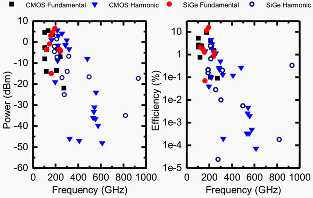

The extremely large bandwidth available at the millimeter-wave (mmW) and terahertz (THz) frequency bands has interesting potentials for a variety of applications such as high-data rate communications, high precision sensing (radar), and low-cost spectroscopy. The technology scaling of silicon integrated circuits, primarily driven by the desire to have faster and lower-power CPUs, has resulted in extremely fast transistors. For example, the maximum achievable Fmax can go well beyond 300 GHz in a 65-nm CMOS process. This naturally motivated many researchers to look at design techniques for creating silicon IC based mmW/THz systems with the hope that the cost of these systems could be significantly lowered with the massive economy of scale of silicon IC manufacturing.

<!--more-->

Among the many challenges of designing at extremely high frequencies, high-efficiency signal generation is one of the most critical. The following chart shows a review of recent works in this area. You will see that signal up to 1 THz can be generated! As impressive as it is, you will probably notice that the output power and dc-to-RF power efficiency at higher frequencies are both quite low. One can probably argue that higher output power can be achieved by power combining. However, with such low efficiency, we will most likely hit a thermal brick wall at some point as we pack more and more of these signal sources together.

How can one improve the power efficiency of signal generation at mmW/THz frequencies? What's the upper bound of the output power and efficiency for a given active device when it's used in an oscillator? My graduate students, Hao Wang and Jingjun Chen, and I have been thinking about these questions for a couple of years and in this series of posts, we'll try to document our thoughts and findings along the way.

[//]: # (Turns out that people have been thinking about this problem from very early on. In 1968, Vehovec documented in his book a method for optimizing the output power of a transistor oscillator circuit. He formulated the problem in terms of the complex voltage gain across the transistor. Shown in the following figure, a transistor oscillator is considered as a combination of an active device and a passive feedback network. The ratio between the voltage at the output and the input port of the active device is defined as the voltage gain. In the steady state, we use phasors to represent the voltages and therefore the voltage gain is complex.)
