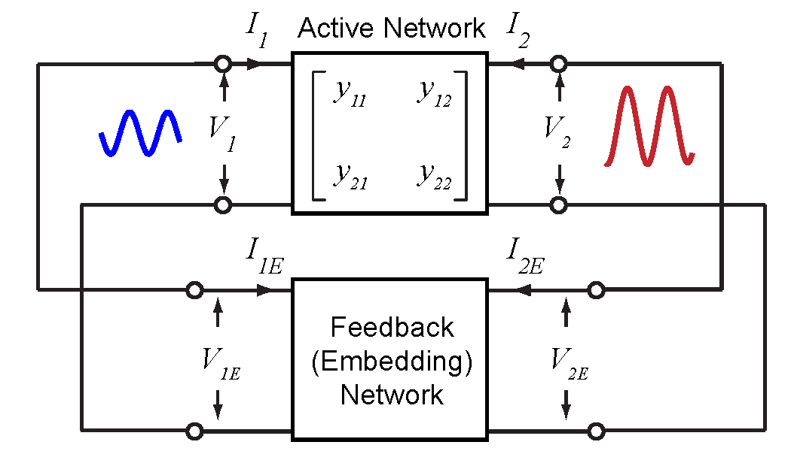
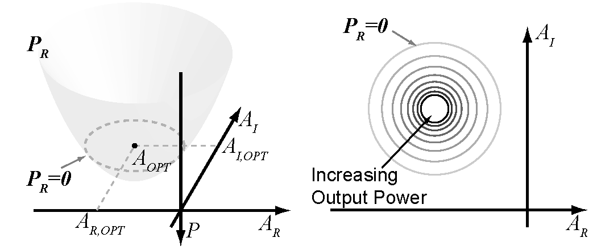
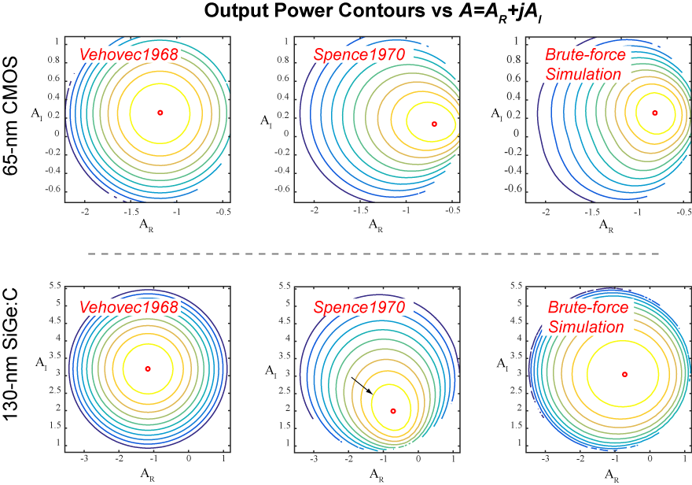

[//]: # (Turns out that people have been thinking about this problem from very early on. In 1968, Vehovec documented in his book a method for optimizing the output power of a transistor oscillator circuit. He formulated the problem in terms of the complex voltage gain across the transistor. Shown in the following figure, a transistor oscillator is considered as a combination of an active device and a passive feedback network. The ratio between the voltage at the output and the input port of the active device is defined as the voltage gain. In the steady state, we use phasors to represent the voltages and therefore the voltage gain is complex.)

Turns out that people have been thinking about this problem from very early on.

In [Vehovec1968], a method for optimizing the output power of a transistor oscillator circuit was proposed. Vehovec formulated the problem in terms of the complex voltage gain across the transistor. Shown in the following figure, a transistor oscillator is considered as a combination of an active device and a passive feedback network. The ratio between the voltage at the output and the input port of the active device is defined as the voltage gain. In the steady state, we use phasors to represent the voltages and therefore the voltage gain is complex.

\begin{equation}
    A=A_R+jA_I=\frac{V_2}{V_1},
\end{equation}
where $A_R$ and $A_I$ are the real and imaginary parts of $A$, respectively.

<!--more-->

Let $y_{ij}=g_{ij}+jb_{ij}$ denote the Y-parameters of the network. By definition,

$$
\begin{align}
	I_1 & = y_{11}V_1+y_{12}V_2, \nonumber \\
	I_2 & = y_{21}V_1+y_{22}V_2.
\end{align}
$$

The power flowing from the two-port network can be found by  

$$
\begin{align}
	P_R ={} & -\frac{1}{2} \Re{(V^*_1 I_1+V^*_2 I_2)} \nonumber \\
      ={} & -\frac{1}{2} \left|V_1 \right|^2 \left[g_{11}+g_{22} \left(A_R^2+A_I^2 \right) + A_R \left(g_{12}+g_{21}\right) - A_I(b_{12} - b_{21}) \right] \nonumber \\
	    ={}	& -\frac{g_{22}\left|V_1 \right|^2}{2} \left[ \left(A_R+\frac{g_{21}+g_{12}}{2g_{22}} \right)^2 + \left(A_I+\frac{b_{21}-b_{12}}{2g_{22}} \right)^2 + \frac{4g_{11}g_{22}-|y_{21}+y_{12}^*|^2}{4g_{22}^2} \right] \nonumber \\
\end{align}
$$

If we assume that $V_1$ is a constant with respect to $A$, then $P_R$ can be normalized

$$
\begin{equation}
  \frac{P_R}{\displaystyle \frac{1}{2}\left|V_1 \right|^2} = -g_{22}\Bigg[\left(A_R+\frac{g_{21}+g_{12}}{2g_{22}}\right)^2+\left(A_I+\frac{b_{21}-b_{12}}{2g_{22}}\right)^2 + \frac{4g_{11}g_{22}-|y_{21}+y_{12}^*|^2}{4g_{22}^2}\Bigg]
\end{equation}
$$

Eqn. 3 shows that the power $P_R$ forms a paraboloid with respect to the real and imaginary parts of the complex voltage gain. Maximum value of $P_R$ is reached at the apex of the paraboloid, and the corresponding optimum complex voltage gain is given by

$$
\begin{equation}
    A_{opt} = -\frac{g_{21}+g_{12}}{2g_{22}} - j\frac{b_{21}-b_{12}}{2g_{22}} = -\frac{y_{21}+y^*_{12}}{2g_{22}}.
    \label{eqn:aopt}
\end{equation}
$$

However, the acute reader may wonder, why does $\|V_1\|$ have to be a constant? After all, in an oscillator, it is very difficult to predict the final saturating amplitude of the oscillation. And there is no clear substantiation that $\|V_1\|$ must be a constant.

In fact, around the same time as [Vehovec1968], Spence solved the optimization problem using a slightly different assumption. He assumed that $|V_1||V_2|$, rather than $|V_1\|$ alone, is a constant. Under this assumption,
$$
\begin{align} \label{eqn:pr_v1v2}
\frac{P_R}{\displaystyle \frac{1}{2}\left|V_1\right|\left|V_2\right|} =-\Bigg[\left(\left|A\right|^{-1} g_{11}+ \left|A\right| g_{22}\right) + |y_{12}+y_{21}^*|
\cos\left(\angle(y_{12}+y_{21}^*)+\angle A \right)\Bigg].
\end{align}.
$$

Now, if $g_{11}$ and $g_{22}$ are both positive, the optimum oscillation condition should be achieved at
$$
\begin{equation}\label{eqn:aopt_v1v2}
\left|A_{opt}\right|=\sqrt{\frac{g_{11}}{g_{22}}}.
\end{equation}
$$

This condition is different from that of Eqn. 4. **So which one is correct?**

As you might have guessed, the answer is neither. To see this, let's compare these equations with simulated oscillator performances for two different technologies, a 65-nm bulk CMOS for mixed-signal/RF applications and a 130-nm SiGe:C HBT. The simulations are performed at 215 GHz.

A few interesting observations can be made.

For the CMOS oscillator, the $A_{opt}$ from simulation is closer to Spence's prediction than Vehovec's.  For SiGe:C HBT however, the simulated $A_{opt}$ is closer to Vehovec's. This is somewhat a proof that neither $\|V_1\$ or $\|V_1\|\|V_2\|$ should be assumed a constant. It depends on the process!

For the CMOS oscillator, the simulated $\|A_{opt}\|$ is almost 1 whereas it's ~3.3 for the SiGe:C HBT. This is probably due to the higher current gain of the HBT transistor.

Lastly, we note that although the respective theories of Vehovec and Spence seem to deviate from the true $A_{opt}$ (assuming that the brute-force non-linear simulations are accurate enough), they still seem reasonable as a first approximation. In the next couple of blog posts, we will show that reality is unfortunately not that easy on us. We will also explain how to perform the simulations for those of you that have been wondering.

### References

**[Vehovec1968]** M. Vehovec, L. Houselander, and R. Spence, “On oscillator design for maximum power,” IEEE Transactions on Circuit Theory, vol. 15, no. 3,
pp. 281–283, Sep 1968.

**[Spence1970]** R. Spence, Linear Active Networks. New York: Wiley-Interscience, 1970.

**[Wang2018]** Hao Wang, Jingjun Chen, James T.S. Do, Hooman Rashtian, Xiaoguang Liu, "High-Efficiency Millimeter-wave Single-ended and Differential Fundamental Oscillators in CMOS," IEEE Journal of Solid State Circuits, vol. 53, no. 8, pp. 2151-2163, Aug, 2018.
