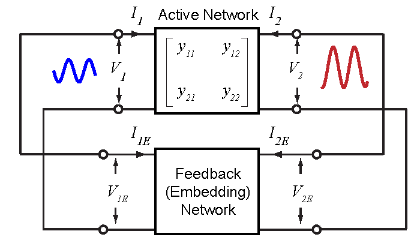

<!--more-->

[//]: # (Turns out that people have been thinking about this problem from very early on. In 1968, Vehovec documented in his book a method for optimizing the output power of a transistor oscillator circuit. He formulated the problem in terms of the complex voltage gain across the transistor. Shown in the following figure, a transistor oscillator is considered as a combination of an active device and a passive feedback network. The ratio between the voltage at the output and the input port of the active device is defined as the voltage gain. In the steady state, we use phasors to represent the voltages and therefore the voltage gain is complex.)

Turns out that people have been thinking about this problem from very early on.

In 1968, Vehovec documented in his book a method for optimizing the output power of a transistor oscillator circuit. He formulated the problem in terms of the complex voltage gain across the transistor. Shown in the following figure, a transistor oscillator is considered as a combination of an active device and a passive feedback network. The ratio between the voltage at the output and the input port of the active device is defined as the voltage gain. In the steady state, we use phasors to represent the voltages and therefore the voltage gain is complex.

\begin{equation}
    A=A_R+jA_I=\frac{V_2}{V_1},
\end{equation}
where $A_R$ and $A_I$ are the real and imaginary parts of $A$, respectively.

Let $y_{ij}=g_{ij}+jb_{ij}$ denote the \mbox{$Y$-parameters} of the network. By definition,
\begin{align}
	I_1 & = y_{11}V_1+y_{12}V_2, \nonumber \\
	I_2 & = y_{21}V_1+y_{22}V_2.
	\label{eqn:y}
\end{align}

The power flowing from the \mbox{two-port} network can be found by       
\begin{align}
	% alignment of multiple multi-line equations, solution found here: https://tex.stackexchange.com/questions/44450/how-to-align-a-set-of-multiline-equations
	P_R ={} & -\frac{1}{2} \Re{(V^*_1 I_1+V^*_2 I_2)} \nonumber \\
      ={} & -\frac{1}{2} \left|V_1 \right|^2 \left[g_{11}+g_{22} \left(A_R^2+A_I^2 \right) + A_R \left(g_{12}+g_{21}\right) - A_I(b_{12} - b_{21}) \right] \nonumber \\
	    ={}	& -\frac{g_{22}\left|V_1 \right|^2}{2} \left[ \left(A_R+\frac{g_{21}+g_{12}}{2g_{22}} \right)^2 + \left(A_I+\frac{b_{21}-b_{12}}{2g_{22}} \right)^2 + \frac{4g_{11}g_{22}-|y_{21}+y_{12}^*|^2}{4g_{22}^2} \right] \nonumber \\
			={}	& -\frac{g_{22}\left|V_1 \right|^2}{2} \left[ \left(A_R+\frac{g_{21}+g_{12}}{2g_{22}} \right)^2 + \left(A_I+\frac{b_{21}-b_{12}}{2g_{22}} \right)^2 + \frac{4(g_{11}g_{22}-g_{21}g_{12})-|y_{21}-y_{12}|^2}{4g_{22}^2} \right]. \\
	    ={}	& -\frac{g_{22}\left|V_1 \right|^2}{2} \Bigg[ \left(A_R+\frac{g_{21}+g_{12}}{2g_{22}} \right)^2 + \left(A_I+\frac{b_{21}-b_{12}}{2g_{22}} \right)^2 + \frac{4g_{11}g_{22}-|y_{21}+y_{12}^*|^2}{4g_{22}^2} \Bigg]. \nonumber \\
\end{align}

If we assume that $V_1$ is a constant with respect to $A$, the validity of which will be discussed shortly, the $P_R$ can be normalized by $\left|V_1 \right|^2$.

\begin{align} \label{eqn:pr_n}
\frac{P_R}{\displaystyle \frac{1}{2}\left|V_1 \right|^2} = -g_{22}\Bigg[\left(A_R+\frac{g_{21}+g_{12}}{2g_{22}}\right)^2+\left(A_I+\frac{b_{21}-b_{12}}{2g_{22}}\right)^2 \nonumber \\ + \frac{4g_{11}g_{22}-|y_{21}+y_{12}^*|^2}{4g_{22}^2}\Bigg]
\end{align}

\eqref{eqn:pr_n} shows that the power $P_R$ forms a paraboloid with respect to the complex voltage gain ($A_R$ and $A_I$) (Fig.~\ref{fig:pr_theory}). Maximum value of $P_R$ is reached at the apex of the paraboloid, and the corresponding optimum complex voltage gain is given by
\begin{equation}
    A_{opt} = -\frac{g_{21}+g_{12}}{2g_{22}} - j\frac{b_{21}-b_{12}}{2g_{22}} = -\frac{y_{21}+y^*_{12}}{2g_{22}}.
    \label{eqn:aopt}
\end{equation}
