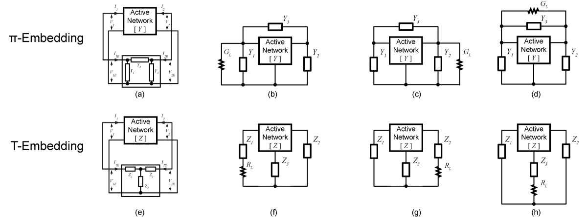

Before we reveal more issues with Vehovec's and Spence's design approaches, let's talk a little bit about how the last figure of the last post was generated, i.e. how we simulated the oscillator output power given a complex voltage gain $A$.

Using the following figure as a starting point, we note that in equilibrium, the circuit is governed by the Kirchoff's current law, that is
$$
\begin{align}\label{eqn:kcl}
	I_1 + I_{1E} = 0, \nonumber \\
	I_2 + I_{2E} = 0.
\end{align}
$$

<!--more-->

  Figure 1. 2-port description of a feedback oscillator.

Because the current variables are all phasors, this set of equations contains actually 4 real-valued equations. Assuming that the parameters of the active networks are known, then to satisfy the 4 equations, we would need 4 independent variables. The output load resistance is one for sure. To minimize the loss, we can then conclude that the external embedding network must have 3 reactive elements. This leaves us with only two choices, a $\pi$ network or a $T$ network, as shown below. The load resistor can be connected in parallel (in a $\pi$ network) or in series (in a $T$ network) with any of the three reactive components, leading to 6 different topologies altogether. These topologies are essentially the "three-point" oscillators that we have all learned about.  

 Figure 2. 6 topologies of three-point oscillators.

Based on these topologies, we can then try to solve for the embedding network component values using Eqn. (1). Take the topology of Fig. 2(b) for example, we can derive the following matrix equation from which the embedding elements can be solved. Obviously, it wouldn't be hard to derive the appropriate equations for the other topologies.

$$
\begin{equation} \label{eqn:matrix_equation}
  \begin{bmatrix}  
  1 & 0  &1-A_R  & 0 & 0  & A_I  \\
  0 & 0  & -A_I  & 1 & 0  & 1-A_R \\
  0 &A_R &A_R-1  &0  &-A_I&-A_I\\
  0 &A_I &A_I    &0  &A_R &A_R-1
  \end{bmatrix}
  \left[  \begin{array} {c}  
  G_L \\ 0 \\ 0 \\ B_1 \\ B_2 \\ B_3
  \end{array} \right]  
  =
  \left[  \begin{array} {c}  
  -g_{11} - \Re(Ay_{12}) \\ -b_{11} - \Im(Ay_{12}) \\ -g_{21} - \Re(Ay_{22}) \\ -b_{21} - \Im(Ay_{22})
  \end{array}  \right]
\end{equation}
$$

So this is how we ran the brute-force oscillator simulations in [our last blog](/blog/2018-06-10-high-efficiency-oscillator-design-2). We construct a grid of the complex voltage gain $A$. For each $A$, we use Eqn. (\ref{eqn:matrix_equation}) to calculate the embedding network elements. Then we wrote a script in Cadence to automatically generate a netlist according to the topology of choice and run the simulation. This way, we can automate the process to sweep through all possible $A$ values.

Finally, a few notes are in order regarding oscillator topologies.
 - We intentionally did not draw the ground reference in the oscillator schematics. This is because the circuit will oscillate independent of where the reference is.
 - Most classical oscillator designs (e.g. Colpitts, Hartley, Clapp, Pierce, Seiler, Vackar, Lampkin) belong to the $\pi$ topologies. Later we will show that if the embedding components are ideal, i.e. with infinite Q, $\pi$ and $T$ embedded oscillators provide theoretically identical output power and efficiency. When considering component $Q$, the $T$ embedded oscillators outperform the $\pi$ embedded oscillations in many regards. However, the $T$ embedded oscillators seem to be much less popular in history. **Why is this?** We are not sure yet, and it sure seems to be an interesting topic of study :)

### References

**[Vehovec1968]** M. Vehovec, L. Houselander, and R. Spence, “On oscillator design for maximum power,” IEEE Transactions on Circuit Theory, vol. 15, no. 3,
pp. 281–283, Sep 1968.

**[Spence1970]** R. Spence, Linear Active Networks. New York: Wiley-Interscience, 1970.

**[Wang2018]** Hao Wang, Jingjun Chen, James T.S. Do, Hooman Rashtian, Xiaoguang Liu, "High-Efficiency Millimeter-wave Single-ended and Differential Fundamental Oscillators in CMOS," IEEE Journal of Solid State Circuits, vol. 53, no. 8, pp. 2151-2163, Aug, 2018.
