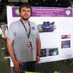
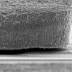
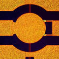
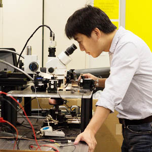
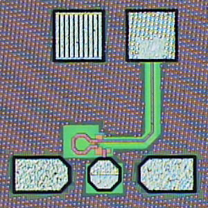

    <h1>We have moved to the Southern University of Science and Technology (SUSTech), Shenzhen, China!</h1>
    <h3>This website will go offline by Jul 2022!</h3>

### Welcome to the Davis Advanced RF Technologies (DART) lab
<!---

-->

     

We are a group of researchers with a keen interest in many exciting areas of high-frequency and high-speed electronics. Our [research](/research/) interests include:

- High-frequency (RF to THz) integrated circuits;
- Microelectronic and photonic devices, such as micro-electromechanical (MEMS) devices;
- Novel antennas, frequency selective surfaces, and passive components;
- Reconfigurable high-frequency circuits and systems;
<!-- - High-precision sensing systems using radar and laser time-of-flight (ToF) principles; -->
- Applications of high-frequency electronics to biomedical, industrial, environmental, and humanitarian problems;
- High-speed wireline and optical communications circuits.

Critical to our scientific research efforts is a pursuit of fundamental understanding of the engineering principles of high frequency electronics. A major mission of our work is to formulate and disseminate such understanding through university [education](/education/) as well as community [outreach](/education/outreach.html).
<!---
The DART lab is housed in Kemper Hall on the beautiful UC Davis campus. The lab is affiliated with the Davis Millimeter-wave Research Center (DMRC). The DMRC is broadly focused on fostering millimeter wave technology for wireless communications, radar, sensing, and imaging systems.
-->

<!--

    A postdoc researcher position is available. More details can be found <a href="/people/postdoc-cm.html"> here </a>.

-->
<!---

    A Ph.D. position is available for Fall 2017. Strong analytical capabilities and a background in analog and/or radio frequency IC are preferred.

<!---
#### A postdoc researcher position is available for 2016. More details can be found [here](/postdoccm.html).

We are always looking for motivated students and researchers to join the group. Read [more](/joiningdart.html) if you are interested.

### Blog



#### [{{ latest_blog.date | date_to_string }}] » <a href="{{ latest_blog.url }}" title="{{ latest_blog.title }}">{{ latest_blog.title }}</a>

{{ latest_blog.excerpt }} [Read More...]({{ latest_blog.url }})

-->
