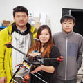
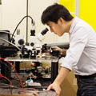

### Welcome to the Davis Advanced RF Technologies (DART) lab
<!---

-->

     

We are a group of researchers with a keen interest in many exciting areas of high frequency electronics. Our [research](/research/) interests include:

- Reconfigurable high frequency devices and components;
- High frequency integrated circuits;
- High frequency communication and radar systems and their application in biomedical, societal, and environmental applications.

Critical to our scientific research efforts is a pursuit of fundamental understanding of the engineering principles of high frequency electronics. A major mission of our work is to formulate and disseminate such understanding through university [education](/education/) as well as community outreach.
<!---
The DART lab is housed in Kemper Hall on the beautiful UC Davis campus. The lab is affiliated with the Davis Millimeter-wave Research Center (DMRC). The DMRC is broadly focused on fostering millimeter wave technology for wireless communications, radar, sensing, and imaging systems.
-->

<!--

    A postdoc researcher position is available. More details can be found <a href="/people/postdoc-cm.html"> here </a>.

-->
<!---

    A Ph.D. position is available for Fall 2017. Strong analytical capabilities and a background in analog and/or radio frequency IC are preferred.

<!---
#### A postdoc researcher position is available for 2016. More details can be found [here](/postdoccm.html).

We are always looking for motivated students and researchers to join the group. Read [more](/joiningdart.html) if you are interested.
-->


  
      » [{{ blog.date | date_to_string }}] » <a href="{{ blog.url }}" title="{{ blog.title }}">{{ blog.title }}</a> 
    

