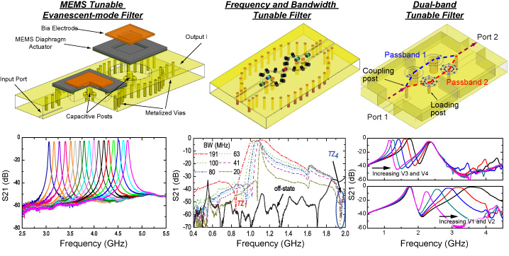

Test a display math with equation number:
\begin{equation}
   |\psi_1\rangle = a|0\rangle + b|1\rangle
\end{equation}
Is it O.K.?

Test a display math with equation number:
$$
  \begin{align}
    |\psi_1\rangle &= a|0\rangle + b|1\rangle \\\\
    |\psi_2\rangle &= c|0\rangle + d|1\rangle
  \end{align}
$$
Is it O.K.?

Test a display math with equation number:
\begin{align}
    |\psi_1\rangle &= a|0\rangle + b|1\rangle \\\\
    |\psi_2\rangle &= c|0\rangle + d|1\rangle
\end{align}
Is it O.K.?

And test a display math without equaltion number:
\begin{align\*}
    |\psi_1\rangle &= a|0\rangle + b|1\rangle \\\\
    |\psi_2\rangle &= c|0\rangle + d|1\rangle
\end{align\*}
Is it O.K.?


      » [{{ post.date | date_to_string }}] » <a href="{{ post.url }}" title="{{ post.title }}">{{ post.title }}</a> 



<ol reversed>
	
		
		<li>     
    		
				[{{ paper.note }}] &nbsp;
			
    		{{ paper.author }}, "{{ paper.title }},"  <i> {{ paper.journal }}</i>, vol. {{ paper.volume }}, no. {{ paper.number }}, pp. {{ paper.pages }}, {{ paper.month }}, {{ paper.year }}. &nbsp; <a href="http://dx.doi.org/{{ paper.doi }}">DOI:{{ paper.doi }}</a> |  </li>
		
	
</ol>
